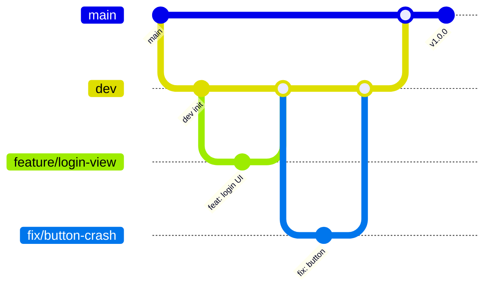

# 2025-C6-M4-DanDan
AppleDeveloperAcademy@Postech Challenge6

## Git 컨벤션

### 브랜치 전략 (Git Flow 간소화 버전)
- `main`: 배포된 안정적인 코드 (릴리즈 버전)
- `dev`: 개발 중인 코드들이 통합되는 브랜치
- `feat/*`: 새로운 기능 개발
- `fix/*`: 버그 수정
- `docs/*`: 문서 작업 (README, 주석 등)
- `refactor/*`: 코드 리팩토링
- `chore/*`: 설정, 빌드 관련 작업

### 브랜치 흐름

#### 도식화
```bash
main ←── dev
          ├── feat/login-view ───────┐
          ├── fix/button-crash ──────┤
          ├── docs/readme-update ────┤ → PR → dev (머지 후 브랜치 삭제)
          ├── refactor/user-manager ─┤
          └── chore/xcode-settings ──┘
```

#### 코드 흐름


**작업 순서**
1. `dev`에서 작업용 브랜치 생성
2. 해당 브랜치에서 작업 완료
3. Pull Request 생성 (작업 브랜치 → `dev`)
4. 코드 리뷰 및 승인
5. `dev`로 머지
6. 작업 브랜치 삭제
7. 릴리즈 준비 시 `dev` → `main` 머지

**핵심 원칙**
- 모든 작업 브랜치는 `dev`에서 분기
- 모든 작업 브랜치는 `dev`로 머지
- `main`은 릴리즈 시에만 업데이트
- `dev`는 언제든 실험 가능한 안전한 공간


### 브랜치 네이밍 규칙

**형식**: `타입/설명` 또는 `타입/설명-이슈번호`
- **구분자**: 하이픈(`-`) 사용 통일
- **설명**: 간결하고 명확한 영어 단어 조합

**개발 초반 (view 단위)**
- `feat/login-view`
- `feat/profile-view`
- `feat/home-view`
- `feat/settings-view`

**개발 중후반 (기능 단위)**
- `feat/user-authentication`
- `feat/data-sync`
- `feat/push-notification`

**이슈 연동 예시**
```bash
feature/login-view-12
fix/button-crash-25
docs/readme-update-8
```

### 브랜치 생성 및 작업 흐름

```bash
# 새 기능 개발 시
git checkout dev
git pull origin dev
git checkout -b feature/login-view

# 작업 완료 후
git add .
git commit -m "feat: 로그인 화면 UI 구현"
git push origin feature/login-view
```

---

## 커밋 컨벤션 

### 커밋 메시지 규칙

**형식**
```
타입: 간단한 설명

상세 설명 (선택사항)
```

**커밋 타입**
- `feat`: 새로운 기능 추가
- `design`: 디자인 반영, 수정 등
- `fix`: 버그 수정
- `docs`: 문서 수정
- `style`: 코드 포맷팅, 세미콜론 누락 등
- `refactor`: 코드 리팩토링
- `test`: 테스트 코드 추가/수정
- `chore`: 빌드 관련, 패키지 매니저 설정 등

**예시**
```
feat: 사용자 로그인 기능 구현
fix: 버튼 터치 이벤트 오류 수정
docs: README 파일 업데이트
style: 코드 들여쓰기 정리
refactor: UserManager 클래스 구조 개선
```

### Pull Request 규칙

**1. 제목 형식**: `타입: 이슈번호 간단한 설명`
- 예: `Feat: #167 사용자 프로필 화면 구현`
- 예: `Fix: #288 버튼 터치 이벤트 오류 수정`

**2. 내용 템플릿**
```markdown
## 관련 이슈
- Closes #12

## 변경사항
- 주요 변경 사항 요약

## 스크린샷
- UI 작업의 경우, 구현한 화면 첨부

## 테스트 / 검증 내역
- 동작 확인 여부나 시나리오 테스트 내용

## 기타 공유 사항
- 리뷰어가 참고하면 좋을 정보, 고민했던 지점

```

**3. 리뷰 규칙**
- 리뷰어: 최소 2명 이상의 Approved 필요
- Merge 방식: Squash and merge 고정

---

## 이슈 관리

### 이슈 생성 규칙
**이슈 제목**: `타입: 간단한 설명`
- 예: `✨ Feature: 로그인 화면 구현`
- 예: `🐞 Bug: 앱 크래시 오류`

**이슈 라벨**
- `feat`: 새로운 기능
- `bug`: 버그 수정
- `chore`: 기타 작업
- `docs`: 문서 작업
- `design`: 디자인 반영 및 수정

### 이슈-PR 연동
1. **이슈 생성**: 작업할 내용을 이슈로 먼저 생성
2. **브랜치 생성**: 이슈 번호를 포함하여 브랜치 생성
   ```bash
   git checkout -b feature/login-view-#12
   ```
3. **PR 생성**: PR 제목과 설명에 이슈 번호 포함
   - 제목: `Feature: #167 예약 취소 구현`
   - 설명에 `Closes #12` 또는 `Fixes #12` 추가
  

### 금지사항
- `main` 브랜치에 직접 push 금지
- 커밋 메시지에 의미없는 내용 금지 (예: "수정", "테스트")
- 대용량 파일(.xcuserstate, .DS_Store 등) 커밋 금지
